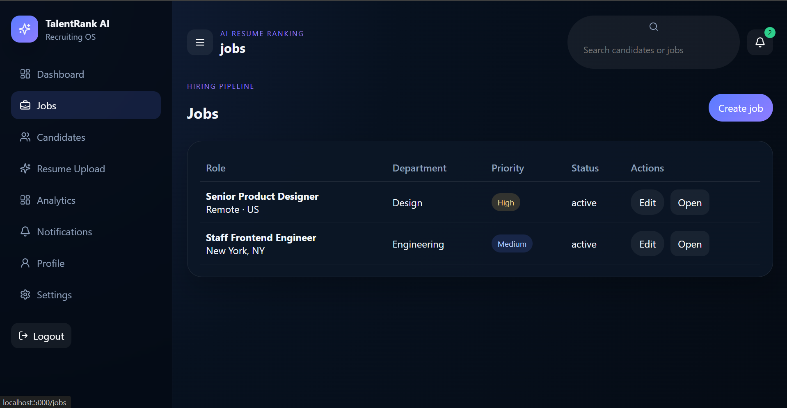
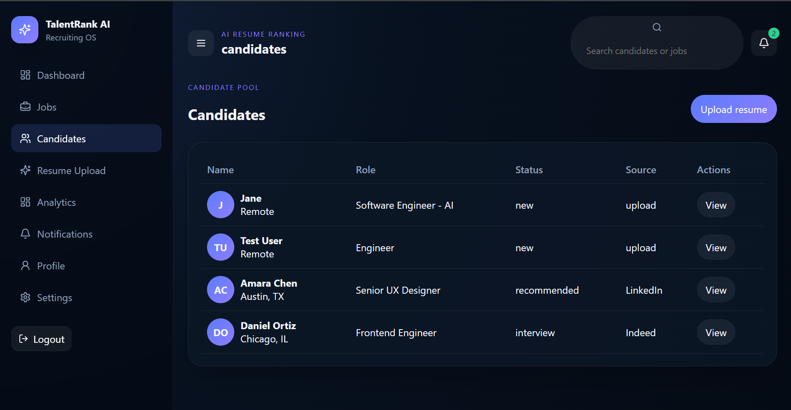
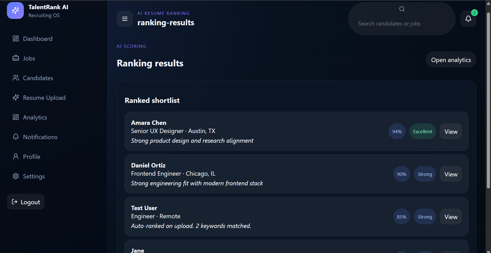
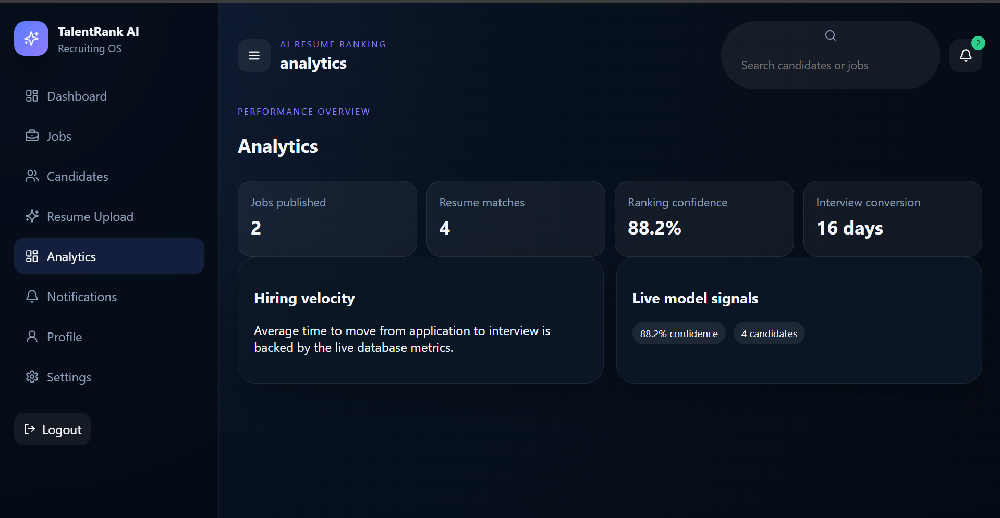

# TalentRank AI — Documentation

## Project Overview

TalentRank AI is an AI-assisted recruiting platform designed to simplify the hiring process. It enables recruiters to create job postings, upload candidate resumes, automatically rank applicants using an AI-powered scoring engine, and analyze hiring metrics through an interactive dashboard.

The application is built using a modern full-stack architecture with a React frontend, Express.js backend, and SQLite database. It demonstrates authentication, CRUD operations, resume management, AI-assisted candidate ranking, analytics, and complete deployment using GitHub, Render, and Vercel.

---

## Live Demo

### Application

- **Frontend (Vercel):** https://talent-rank-ai-mocha.vercel.app/

### Backend

- **API:** https://talentrank-ai-i0of.onrender.com/
- **Health Check:** https://talentrank-ai-i0of.onrender.com/health

### Source Code

- **GitHub Repository:** https://github.com/SiddardhaShayini/TalentRank-AI

---

## Technology Stack

### Frontend

- React 18
- Vite
- JavaScript
- HTML5
- CSS3

### Backend

- Node.js
- Express.js

### Database

- SQLite

### Authentication

- JWT (JSON Web Token)

### Deployment

- GitHub
- Vercel
- Render

---

## Features

| Feature | Description |
|---|---|
| **Authentication** | JWT-based login and registration with protected routes. |
| **Dashboard** | Overview of jobs, candidates, rankings, and hiring analytics. |
| **Job Management** | Create, edit, update, and delete job postings. |
| **Candidate Management** | Browse candidate profiles and manage applications. |
| **Resume Upload** | Upload resumes with candidate information. |
| **AI Ranking** | Automatically scores and ranks candidates based on skills and experience. |
| **Analytics** | Displays hiring metrics and platform statistics. |
| **Notifications** | Activity feed for recruiters. |
| **Responsive UI** | Optimized for desktop and tablet devices. |

---

## Folder Structure

```text
TalentRank-AI/
│
├── frontend/
│   ├── src/
│   │   ├── components/
│   │   ├── pages/
│   │   ├── styles/
│   │   ├── utils/
│   │   │   └── api.js
│   │   └── assets/
│   ├── public/
│   ├── package.json
│   └── vite.config.js
│
├── backend/
│   ├── src/
│   │   ├── config/
│   │   ├── controllers/
│   │   ├── db/
│   │   ├── middleware/
│   │   ├── routes/
│   │   ├── services/
│   │   ├── utils/
│   │   └── server.js
│   ├── uploads/
│   ├── talentrank.db
│   └── package.json
│
├── docs/
│   └── screenshots/
│
└── README.md
```

---

## Screenshots

> Add screenshots of your application inside `docs/screenshots`.

| Page | Screenshot |
|------|------------|
| Login |  |
| Dashboard |  |
| Jobs |  |
| Resume Upload |  |
| Candidate Ranking |  |
| Analytics |  |

---

## Installation

### Prerequisites

- Node.js 20 or later
- npm

### Clone Repository

```bash
git clone https://github.com/SiddardhaShayini/TalentRank-AI.git
cd TalentRank-AI
```

### Install Backend Dependencies

```bash
cd backend
npm install
```

### Install Frontend Dependencies

```bash
cd ../frontend
npm install
```

---

## Environment Variables

### Backend

The backend reads the JWT secret using the following order:

1. `SESSION_SECRET`
2. `JWT_SECRET`
3. Default value (`talentrank-secret`)

Example:

```env
SESSION_SECRET=your-secret-key
```

### Frontend (Production)

Create:

```text
frontend/.env.production
```

Add:

```env
VITE_API_URL=https://talentrank-ai-i0of.onrender.com
```

---

## Running the Backend

```bash
cd backend
```

Linux/macOS

```bash
PORT=3001 node src/server.js
```

Windows PowerShell

```powershell
$env:PORT=3001
npm start
```

The backend will:

1. Initialize the SQLite database.
2. Seed demo data.
3. Start on:

```
http://localhost:3001
```

Health Check

```bash
curl http://localhost:3001/health
```

---

## Running the Frontend

```bash
cd frontend
npm run dev
```

The application starts at:

```
http://localhost:5000
```

During development, Vite automatically proxies every `/api/*` request to the backend running on port **3001**.

---

## Demo Credentials

Use the following credentials to explore the application.

**Email**

```
maya@talentrank.ai
```

**Password**

```
password123
```

---

## Deployment

### Deployment Architecture

```text
                GitHub Repository
                       │
          ┌────────────┴────────────┐
          │                         │
          ▼                         ▼
  Vercel (Frontend)         Render (Backend)
          │                         │
          └────────── REST API ─────┘
                       │
                       ▼
                SQLite Database
```

### Deployment Process

1. Push source code to GitHub.
2. Deploy the backend on Render.
3. Deploy the frontend on Vercel.
4. Configure the frontend using:

```env
VITE_API_URL=https://talentrank-ai-i0of.onrender.com
```

5. Every push to the **main** branch automatically triggers a new deployment on Vercel.

---

## Database

The application automatically creates the SQLite database during startup.

Database location:

```text
backend/talentrank.db
```

The schema is initialized automatically from:

```text
backend/src/db/schema.sql
```

### Database Tables

| Table | Description |
|---|---|
| users | Registered users |
| jobs | Job postings |
| candidates | Candidate profiles |
| applications | Candidate applications |
| uploaded_resumes | Resume metadata |
| ai_scores | AI-generated ranking scores |
| notifications | User notifications |

---

## AI Ranking

The application currently uses a lightweight deterministic scoring algorithm.

### Scoring Formula

```text
Base Score                : 70

Skill Bonus               : +3 per skill (Maximum 20)

Experience Bonus          : +7 (Experience > 5 years)

Excellent Match           : 90+

Strong Match              : 80–89

Moderate Match            : Below 80
```

The ranking logic is implemented in:

```text
backend/src/services/rankingService.js
```

The implementation can easily be replaced with a trained machine learning model, OpenAI API, Ollama, or another LLM.

---

## API Overview

### Authentication

| Method | Endpoint | Description |
|---|---|---|
| POST | `/api/auth/register` | Register user |
| POST | `/api/auth/login` | Login |

### Jobs

| Method | Endpoint |
|---|---|
| GET | `/api/jobs` |
| GET | `/api/jobs/:id` |
| POST | `/api/jobs` |
| PUT | `/api/jobs/:id` |
| DELETE | `/api/jobs/:id` |

### Candidates

| Method | Endpoint |
|---|---|
| GET | `/api/candidates` |
| GET | `/api/candidates/:id` |
| POST | `/api/candidates` |
| PUT | `/api/candidates/:id` |
| DELETE | `/api/candidates/:id` |

### Resume

| Method | Endpoint |
|---|---|
| POST | `/api/resume/upload` |
| POST | `/api/resume/parse` |

### Analytics

| Method | Endpoint |
|---|---|
| GET | `/api/analytics` |

### Notifications

| Method | Endpoint |
|---|---|
| GET | `/api/notifications` |

> All API endpoints except `/api/auth/*` require a valid JWT Bearer token.

---

## Future Improvements

- Integrate a real machine learning or LLM-based ranking model.
- Semantic resume parsing using embeddings.
- Candidate search and filtering.
- Email notifications.
- Interview scheduling.
- Role-specific candidate ranking.
- Cloud database support (PostgreSQL/MySQL).
- Resume duplicate detection.
- Multi-user organization support.
- Docker containerization.

---

## Developer

**Siddardha Shayini**

- GitHub: https://github.com/SiddardhaShayini
