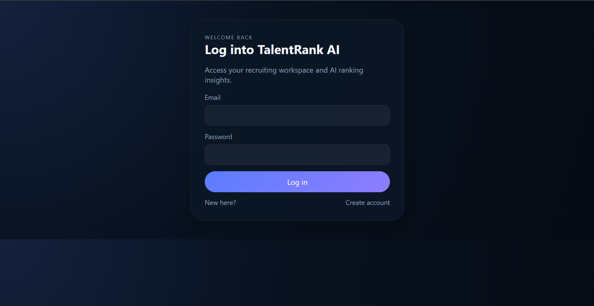
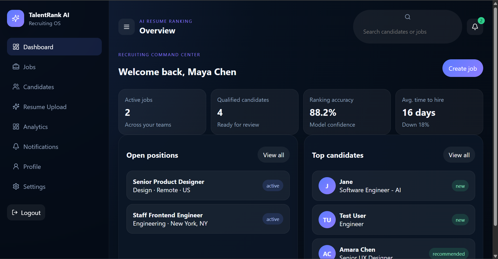

# TalentRank AI — Documentation

## Project Overview

TalentRank AI is a lightweight, AI-assisted recruiting platform. It helps hiring teams publish job openings, upload resumes, and rank candidates automatically using a rule-based scoring engine. The stack is intentionally simple: a React frontend, an Express backend, and a SQLite database — making it easy to run, modify, and extend.

---

## Features

| Feature | Description |
|---|---|
| **Authentication** | JWT-based login and registration. Protected routes redirect to `/login` if the token is missing. |
| **Dashboard** | Live overview of jobs, candidates, ranking accuracy, and average time to hire. |
| **Job Management** | Create, edit, delete, and view job postings. |
| **Candidate Pool** | Browse uploaded candidates, view their profile, and track their status. |
| **Resume Upload** | Upload a resume file plus candidate metadata. The backend creates a candidate, stores the file, and returns an AI score. |
| **AI Ranking** | Candidates are scored and ranked in real time based on skills and experience. |
| **Analytics** | Database-backed metrics for hiring velocity and model confidence. |
| **Notifications** | Activity feed for the logged-in user. |

---

## Folder Structure

```
talentrank-ai/
├── backend/                  # Express API + SQLite
│   ├── src/
│   │   ├── config/           # Environment constants
│   │   ├── controllers/      # HTTP request handlers
│   │   ├── db/               # Database schema, connection, and query helpers
│   │   ├── middleware/       # Authentication middleware
│   │   ├── routes/           # API route definitions
│   │   ├── services/         # Business logic
│   │   └── utils/            # Response helpers
│   ├── uploads/              # Saved resume files
│   └── talentrank.db         # SQLite database (auto-created)
│
├── frontend/                 # React + Vite
│   ├── src/
│   │   ├── components/       # Layout, ProtectedRoute
│   │   ├── data/             # Sample data files (deprecated in favor of API calls)
│   │   ├── pages/            # All application pages
│   │   ├── styles/           # Global CSS
│   │   └── utils/api.js      # API request helper with JWT injection
│   └── vite.config.js        # Dev server + proxy configuration
│
├── docs/screenshots/         # Placeholder screenshots (add your own)
└── README.md                 # Short project overview and run instructions
```

---

## Screenshots

> Placeholder images below. Replace them with real screenshots in `docs/screenshots/` before publishing.

| Page | Placeholder |
|---|---|
| Login | `docs/screenshots/login.png` |
| Dashboard | `docs/screenshots/dashboard.png` |
| Jobs List | `docs/screenshots/jobs.png` |
| Candidate Upload | `docs/screenshots/upload.png` |
| Ranking Results | `docs/screenshots/ranking.png` |
| Analytics | `docs/screenshots/analytics.png` |

```markdown


```

---

## Installation

### Prerequisites

- Node.js 20 (or newer)
- npm 10+

### 1. Clone or import the project

```bash
cd backend && npm install
cd ../frontend && npm install
```

The backend also needs a writable `uploads/` directory. It is created automatically on first startup.

### 2. Environment setup (optional)

The backend reads the JWT secret from these sources in order:

1. `SESSION_SECRET` environment variable
2. `JWT_SECRET` environment variable
3. Default fallback: `talentrank-secret`

For production, always set a real secret via `SESSION_SECRET`.

---

## Running the Backend

```bash
cd backend
PORT=3001 node src/server.js
```
OR
```bash
$env:PORT=3001
npm start
```

The server will:
1. Initialize the SQLite database using `src/db/schema.sql`
2. Seed demo data on first run
3. Listen on `http://localhost:3001`

Health check:

```bash
curl http://localhost:3001/health
```

---

## Running the Frontend

```bash
cd frontend
npm run dev
```

The dev server starts on `http://localhost:5000`. It proxies all `/api/*` calls to the backend at `http://localhost:3001`, so you can run the frontend without worrying about CORS.

---

## Database Setup

No manual setup is required. The SQLite database is created at:

```
backend/talentrank.db
```

Schema is defined in `backend/src/db/schema.sql` and applied by `backend/src/db/database.js` on startup. Seed data is also inserted automatically on first run.

### Key tables

| Table | Purpose |
|---|---|
| `users` | Recruiters and admins |
| `jobs` | Published job postings |
| `candidates` | Candidate profiles |
| `applications` | Links candidates to jobs |
| `uploaded_resumes` | Resume file metadata and parsed text |
| `ai_scores` | AI ranking scores per candidate |
| `notifications` | User activity feed |

---

## AI Model Setup

The current AI scoring is a deterministic, explainable model implemented in `backend/src/services/rankingService.js`. It requires no external API keys or GPU setup.

### Scoring logic

```
Base score:        70
+ skill bonus:     +3 per skill (max 20)
+ experience bonus:+7 if experience > 5 years
Match level:       Excellent ≥ 90, Strong ≥ 80, Moderate < 80
```

To upgrade to a real LLM or ML model, replace the `rankResume` function in `backend/src/services/rankingService.js` with a call to your preferred inference provider (e.g., OpenAI, Anthropic, or a local Ollama instance) and store the returned score in the `ai_scores` table.

---

## API Overview

### Authentication

| Method | Endpoint | Description |
|---|---|---|
| POST | `/api/auth/register` | Create a new account |
| POST | `/api/auth/login` | Log in and receive a JWT |

### Jobs

| Method | Endpoint | Description |
|---|---|---|
| GET | `/api/jobs` | List all jobs |
| GET | `/api/jobs/:id` | Get a single job |
| POST | `/api/jobs` | Create a job |
| PUT | `/api/jobs/:id` | Update a job |
| DELETE | `/api/jobs/:id` | Delete a job |

### Candidates

| Method | Endpoint | Description |
|---|---|---|
| GET | `/api/candidates` | List all candidates |
| GET | `/api/candidates/:id` | Get a single candidate |
| POST | `/api/candidates` | Create a candidate manually |
| PUT | `/api/candidates/:id` | Update a candidate |
| DELETE | `/api/candidates/:id` | Delete a candidate |

### Resume & Ranking

| Method | Endpoint | Description |
|---|---|---|
| POST | `/api/resume/upload` | Upload a resume file and create a scored candidate |
| POST | `/api/resume/parse` | Parse raw resume text into extracted skills |
| GET | `/api/ranking` | Get all candidates with their latest AI scores |

### Analytics & Notifications

| Method | Endpoint | Description |
|---|---|---|
| GET | `/api/analytics` | Dashboard metrics (job count, candidate count, average score) |
| GET | `/api/notifications` | Activity feed for the logged-in user |

All endpoints except `/api/auth/*` require a `Bearer <token>` header.

---

## Future Improvements

- **Job-specific ranking** — Match candidates against a selected job's requirements instead of scoring them in isolation.
- **Duplicate prevention** — Detect and update existing candidates when the same email is uploaded again.
- **Production deployment** — Serve the built frontend from the backend or configure `VITE_API_URL` for separate hosting.
- **Real ML model** — Replace the rule-based scoring with a fine-tuned model or LLM evaluation.
- **Email notifications** — Send alerts when high-scoring candidates are uploaded.
- **Candidate search / filtering** — Add search and filter controls to the candidates list.
